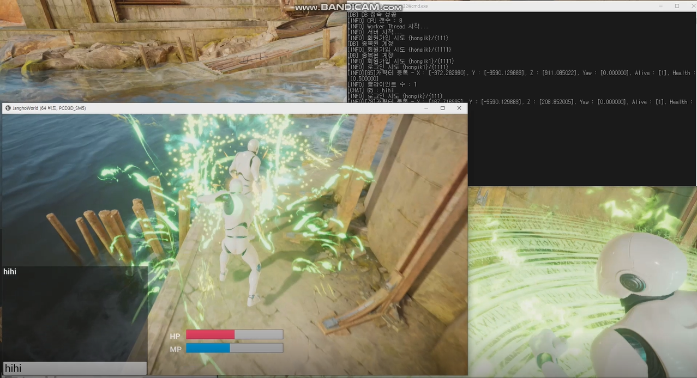

## 프로젝트 개요

* **프로젝트명:** Magic Arena
* **제작기간:** 약 4개월
* **플랫폼:** PC
* **언어:** C++
* **장르:** 배틀로얄 게임
* **엔진:** Unreal Engine 4

## 프로젝트 설명 

자체적으로 제작한 IOCP서버에 언리얼 클라이언트를 구현 및 연동 한 후 MySQL데이터베이스까지
연동하여 로그인 기능까지 추가하여 최대한 MMORPG게임과 비슷한 환경을 구성하였습니다.

* 졸업작품 초기단계 영상
https://www.youtube.com/watch?v=NmF1qHxw6Wc
* 졸업작품 최종 영상
https://www.youtube.com/watch?v=Cb9lzyPxx80

## 구현기능
* 비동기 I/O 입출력
* 실시간 IOCP서버
* 데이터베이스를 통한 로그인 & 회원가입기능
* 채팅 기능(Broadcast 기법)
* 서버 성능 테스트

## 아쉬운점 및 한계점
